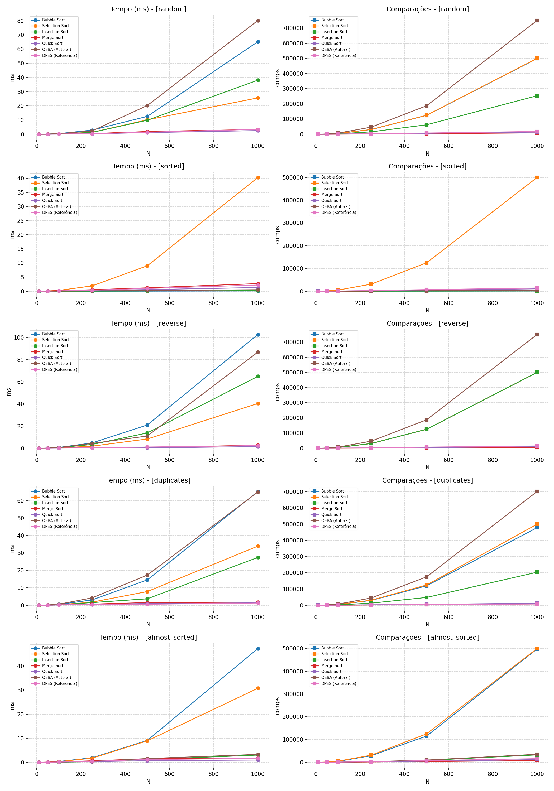

# Trabalho Prático 1 (TP1) - Métodos de Ordenação Autorais

**Disciplina:** Análise e Projeto de Algoritmos (APA) / AL0338  
**Autor:** Bernardo Gomes Dorneles  
**Matrícula:** 2410103114  
**Linguagem:** Python 3  
**Repositório:** [github.com/bNDorneles/APA](https://github.com/bNDorneles/APA)

---

## Proposta e formato de entrega

Este repositório contém a entrega do TP1: concepção, formalização, implementação e validação experimental de um método de ordenação autoral (**OEBA**), comparado com os clássicos da literatura e com a referência docente (**DPES**).

- **Formato:** Opção A - Relatório Técnico Completo
- **Algoritmo autoral:** OEBA (Ordenação por Extremos Bidirecionais Adaptativa), abordagem iterativa in-place com corte adaptativo

---

## Escopo do algoritmo autoral

**OEBA** trabalha com uma janela ativa `[left, right]`. Em cada passo:

1. encontra o mínimo e o máximo da janela em uma varredura;
2. coloca o mínimo na esquerda e o máximo na direita;
3. encolhe a janela;
4. se a desordem adjacente do miolo for baixa (`τ`) ou o miolo for pequeno (`κ`), termina com Insertion Sort.

Isso corrige a "cegueira" do Selection Sort em entradas já ordenadas e evita o excesso de trocas do Bubble Sort, sem virar só um rename de clássico.

---

## Estrutura do repositório

```text
APA/
├── .gitignore
├── README.md
├── pyproject.toml
├── images/
│   └── benchmark_results.png
├── docs/
│   ├── enunciado_tp1.md
│   └── sintese_teorica_ordenacao_apa.md
├── codigo/
│   ├── Makefile
│   ├── README.md
│   └── python/
│       ├── oeba.py                 # Algoritmo autoral (OEBA)
│       ├── authorial.py            # Referência docente (DPES)
│       ├── classical.py            # Bubble, Selection, Insertion, Merge, Quick
│       ├── metrics.py
│       ├── student_template.py
│       ├── test_suite.py
│       ├── test_authorial.py
│       └── benchmark.py
└── relatorio/
    ├── relatorio_tp1.md            # Relatório técnico completo
    ├── benchmark_tabelas.md
    └── figuras/                    # Pseudocódigo e capturas do código
```

---

## Como executar

### 1. Dependências

```bash
pip install matplotlib
# ou, se usar uv:
# uv sync
```

### 2. Testes de corretude

```bash
# Suíte obrigatória + clássicos + OEBA + DPES
python codigo/python/test_suite.py

# Testes específicos da OEBA
python codigo/python/test_authorial.py

# Via Makefile (a partir de codigo/)
make -C codigo test
```

### 3. Benchmarks

```bash
python codigo/python/benchmark.py --trials 3 --plot images/benchmark_results.png

# ou
make -C codigo benchmark
```

<p align="center">
  
</p>

---

## Relatório

O relatório técnico está em [`relatorio/relatorio_tp1.md`](relatorio/relatorio_tp1.md).
