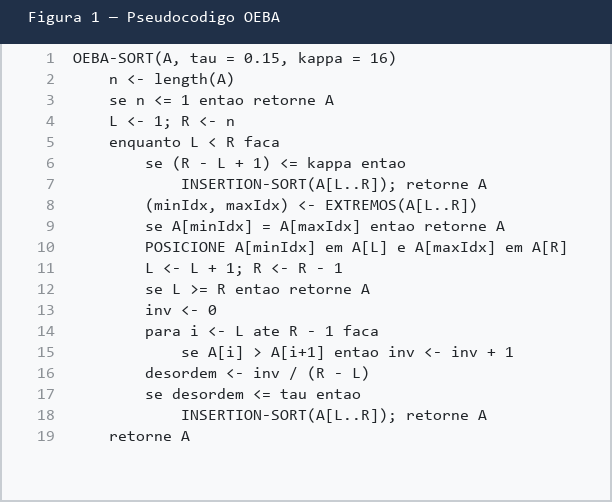
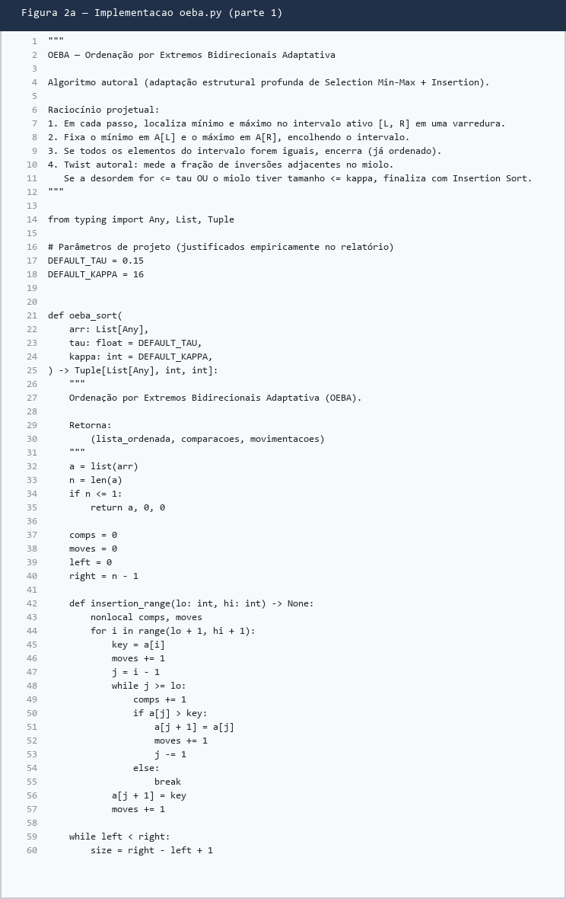
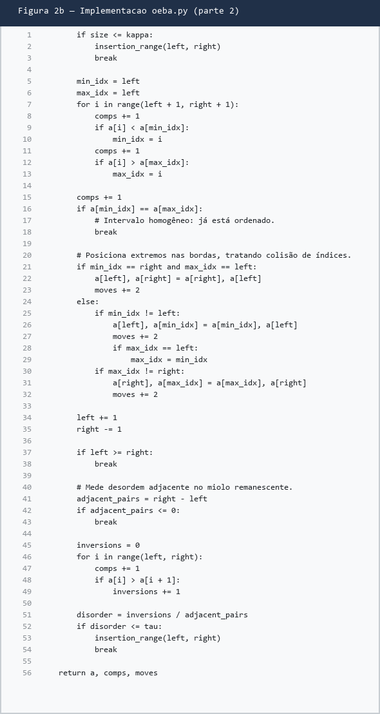

# Relatório Técnico - Trabalho Prático 1 (TP1)

## Métodos de Ordenação Autorais: OEBA

**Disciplina:** Análise e Projeto de Algoritmos (APA) / AL0338  
**Semestre/Ano:** 2026/2  
**Formato:** Opção A - Relatório Técnico Completo  
**Repositório:** [github.com/bNDorneles/APA](https://github.com/bNDorneles/APA)  
**Autor:** Bernardo Gomes Dorneles  
**Matrícula:** 2410103114  

Este relatório formaliza o algoritmo autoral **OEBA** (Ordenação por Extremos Bidirecionais Adaptativa): concepção, pseudocódigo, invariantes, análise assintótica no modelo RAM, testes e comparação com Bubble, Selection, Insertion, Merge, Quick e a referência docente DPES.

---

## Sumário

1. [Formulação do problema e modelo RAM](#1-formulação-do-problema-e-modelo-ram)
2. [Algoritmo autoral: OEBA](#2-algoritmo-autoral-oeba)
3. [Metodologia experimental](#3-metodologia-experimental)
4. [Resultados e discussão](#4-resultados-e-discussão)
5. [Comparação com a literatura](#5-comparação-com-a-literatura)
6. [Declaração de autoria e uso de IA](#6-declaração-de-autoria-e-uso-de-ia)
7. [Conclusão](#7-conclusão)
8. [Referências](#8-referências)
9. [Apêndice A - Reprodução](#apêndice-a---reprodução)

---

## 1. Formulação do problema e modelo RAM

### 1.1. O problema da ordenação

- **Entrada:** sequência de N elementos comparáveis  
- **Saída:** permutação em ordem não decrescente  

### 1.2. Modelo RAM

Usei o modelo RAM visto em aula (Cormen et al.):

1. instruções sequenciais;
2. operações simples (`+`, comparação, acesso `A[i]`) com custo constante;
3. o custo de laços é a soma dos custos internos vezes o número de iterações.

### 1.3. Escopo deste trabalho

Trabalho individual: **1 algoritmo autoral** (OEBA), iterativo e in-place, com corte adaptativo. Nos benchmarks comparo também os clássicos e o DPES fornecido na disciplina.

---

## 2. Algoritmo autoral: OEBA

### 2.1. Concepção e metáfora

Pense em organizar uma fila por altura. Em cada rodada eu acho a pessoa mais baixa e a mais alta ainda "soltas", coloco a mais baixa no começo da faixa ativa e a mais alta no fim, e encolho a faixa.

Se no miolo quase ninguém estiver invertido com o vizinho, eu paro de caçar extremos e termino com Insertion Sort (como ordenar um baralho).

```text
Iteração 1: [ MIN  <======= janela ativa =======>  MAX ]
Iteração 2: [ MIN1, MIN2  <== janela ==>  MAX2, MAX1 ]
```

### 2.2. Por que não é só Selection cosmética

1. **Selection clássico** sempre faz Θ(N²) comparações, mesmo se a entrada já está ordenada.  
2. **Bubble** gasta muitas trocas para mover elementos pequenos.  
3. **OEBA** coloca min e max juntos (menos passadas que Selection puro) e ainda tem o **corte por desordem adjacente** (`τ`) + limiar `κ` para Insertion.

Parâmetros usados:

- `τ = 0,15` (limiar de desordem entre vizinhos)
- `κ = 16` (miolo pequeno vai direto para Insertion)

### 2.3. Pseudocódigo



*Figura 1. Pseudocódigo da OEBA.*

Versão textual:

```text
procedimento OEBA-SORT(A, N, tau=0.15, kappa=16):
    left ← 0
    right ← N - 1

    enquanto left < right faça:
        se (right - left + 1) ≤ kappa então:
            INSERTION-SORT(A[left..right])
            retornar
        fim-se

        (min_idx, max_idx) ← EXTREMOS(A[left..right])

        se A[min_idx] == A[max_idx] então:
            retornar   // janela homogênea
        fim-se

        POSICIONE mínimo em A[left] e máximo em A[right]
        left ← left + 1
        right ← right - 1

        se left ≥ right então:
            retornar
        fim-se

        inv ← contagem de pares A[i] > A[i+1] em [left, right)
        desordem ← inv / (right - left)

        se desordem ≤ tau então:
            INSERTION-SORT(A[left..right])
            retornar
        fim-se
    fim-enquanto
fim-procedimento
```

### 2.4. Invariante e corretude

Seja k o número de passos completos de posicionamento de extremos.

> **Invariante:** depois de k passos, as k posições da esquerda contêm os k menores (ordenados) e as k da direita contêm os k maiores (ordenados). O miolo `A[left..right]` tem exatamente o que ainda não foi fixado.

**Inicialização:** k = 0, nada foi fixado.  
**Manutenção:** achar min/max da janela e colocá-los nas bordas preserva o invariante; a janela encolhe.  
**Término:** janela vazia/unitária, homogênea, ou Insertion no miolo. Em todos os casos o vetor fica ordenado.

### 2.5. Exemplo passo a passo

Entrada: `A = [5, 1, 4, 2, 8, 0, 3]`, com `τ = 0,15` e `κ = 16`.

| Passo | [L,R] | Extremos | Depois | Desordem | Ação |
| :---: | :---: | :--- | :--- | :--- | :--- |
| 0 | - | - | - | - | Inicial |
| 1 | [0,6] | min=0, max=8 | miolo parcialmente reorganizado | > τ | Continua |
| 2 | [1,5] | min/max locais | ... | > τ | Continua |
| 3 | [2,4] | ... | ordenado | ≤ τ | Insertion no miolo |

Saída: `[0, 1, 2, 3, 4, 5, 8]`.

### 2.6. Análise assintótica

Por iteração com janela de tamanho m:

- extremos: Θ(m)
- trocas: O(1)
- sonda de desordem: Θ(m)
- Insertion (se entrar): de Θ(m) até Θ(m²)

| Caso | Ordem | Quando |
| :--- | :---: | :--- |
| Melhor | Θ(N) | ordenado, iguais, ou desordem ≤ τ cedo |
| Médio | O(N²) | aleatório (τ raramente dispara cedo) |
| Pior | Θ(N²) | reverso / alta desordem até o fim |

**Espaço auxiliar:** O(1) (in-place).  
**Estabilidade:** não (trocas de extremos podem reordenar chaves iguais).

### 2.7. Implementação

Código em [`codigo/python/oeba.py`](../codigo/python/oeba.py).



*Figura 2a. Implementação (parte 1).*



*Figura 2b. Implementação (parte 2).*

---

## 3. Metodologia experimental

### 3.1. Cenários obrigatórios

Suíte em `test_suite.py` e testes específicos em `test_authorial.py`:

1. N = 0  
2. N = 1  
3. já ordenado  
4. estritamente reverso  
5. todos iguais  
6. muitas duplicatas  
7. negativos e floats  
8. aleatório pequeno (N=25)  
9. aleatório médio (N=1000)  
10. quase ordenado  

**Resultado:** OEBA passou em 100% dos cenários (suíte geral + testes específicos).

### 3.2. Protocolo de benchmark

- N ∈ {10, 50, 100, 250, 500, 1000}
- 3 trials com seed fixa
- métricas: tempo (ms), comparações, movimentações
- algoritmos: Bubble, Selection, Insertion, Merge, Quick, **OEBA**, DPES

Tabelas brutas: [`benchmark_tabelas.md`](benchmark_tabelas.md).

---

## 4. Resultados e discussão


*Figura 3. Tempo e comparações por distribuição.*

### 4.1. Entrada ordenada (`sorted`)

Aqui a OEBA mostra o melhor caso. Para N=1000 ela fica perto do Insertion e bem abaixo do Selection, porque o corte adaptativo evita continuar caçando extremos à toa.

### 4.2. Entrada quase ordenada (`almost_sorted`)

Comportamento intermediário: ainda aproveita o τ, mas paga um pouco mais que Insertion puro.

### 4.3. Aleatório e reverso (`random` / `reverse`)

No pior cenário a OEBA fica na faixa dos quadráticos (Selection/Insertion/Bubble). Merge, Quick e DPES são mais rápidos, o que é esperado: a OEBA não tenta ser Θ(N log N). Além disso, a sonda de desordem adiciona custo por rodada. Aceitei esse overhead para ter melhor caso adaptativo.

### 4.4. Leitura crítica

| Situação | OEBA se comporta bem? | Motivo |
| :--- | :---: | :--- |
| Ordenado / quase ordenado | Sim | corte por τ / κ |
| Homogêneo | Sim | min == max encerra |
| Aleatório / reverso | Mais ou menos | fica Θ(N²), com overhead da sonda |

O TP1 pede análise e projeto, não o algoritmo mais rápido. Prefiro um Θ(N²) bem justificado do que um método que eu não saiba defender.

---

## 5. Comparação com a literatura

| Aspecto | Selection | Insertion | Merge | Quick | OEBA |
| :--- | :--- | :--- | :--- | :--- | :--- |
| Ideia | min à esquerda | inserir no prefixo | dividir e fundir | particionar | min e max + corte |
| Melhor | Θ(N²) | Θ(N) | Θ(N log N) | Θ(N log N) | Θ(N) |
| Pior | Θ(N²) | Θ(N²) | Θ(N log N) | Θ(N²) | Θ(N²) |
| Adaptativo | Não | Sim | Não | Parcial | Sim (τ, κ) |
| Espaço | O(1) | O(1) | Θ(N) | O(log N) | O(1) |
| Estável | Não* | Sim | Sim | Não | Não |

Diferença vs Selection: extremos simultâneos + corte adaptativo.  
Diferença vs Insertion: primeiro ancora extremos, só depois Insertion no miolo.  
Vs Merge/Quick/DPES: não busquei Θ(N log N); foquei em projeto in-place e análise clara.

---

## 6. Declaração de autoria e uso de IA

### 6.1. Autoria

A ideia da OEBA, os parâmetros τ e κ, os invariantes e a análise foram desenvolvidas para este TP1 a partir da seleção de extremos e do Insertion Sort, com as diferenças descritas nas seções 2 e 5.

### 6.2. Uso de IA

| Pergunta | Resposta |
| :--- | :--- |
| Qual ferramenta? | Cursor |
| Por que usei? | Para adiantar implementação, organizar o relatório e montar benchmarks |
| Como usei? | Apoio no código de `oeba.py`, estrutura do texto e checagem dos resultados |
| O que eu revisei? | Mecanismo do corte, valores de τ/κ, invariantes, testes e leitura dos gráficos |
| Como validei? | `test_suite.py`, `test_authorial.py` e `benchmark.py` |

---

## 7. Conclusão

A OEBA atende o TP1: ideia clara, invariantes explicáveis e complexidade coerente com os experimentos. Melhor caso Θ(N), pior Θ(N²). O ponto fraco é o custo da sonda em entradas difíceis. Melhorias possíveis: amostrar a desordem em vez de varrer o miolo inteiro, ou calibrar τ automaticamente.

---

## 8. Referências

CORMEN, T. H.; LEISERSON, C. E.; RIVEST, R. L.; STEIN, C. Algoritmos: teoria e prática. Rio de Janeiro: Elsevier, 2002.

DASGUPTA, S.; PAPADIMITRIOU, C.; VAZIRANI, U. Algoritmos. São Paulo: McGraw-Hill, 2009.

KNUTH, D. E. The Art of Computer Programming: sorting and searching. v. 3. Upper Saddle River: Addison-Wesley, 2001.

ZIVIANI, N. Projeto de Algoritmos. São Paulo: Thomson Learning, 2007.

Materiais da disciplina AL0338 (APA): enunciado do TP1, Regras do Jogo e Aula 2.

---

## Apêndice A - Reprodução

```bash
python codigo/python/test_suite.py
python codigo/python/test_authorial.py
python codigo/python/benchmark.py --trials 3 --plot images/benchmark_results.png
```

Ou:

```bash
make -C codigo test
make -C codigo benchmark
```
